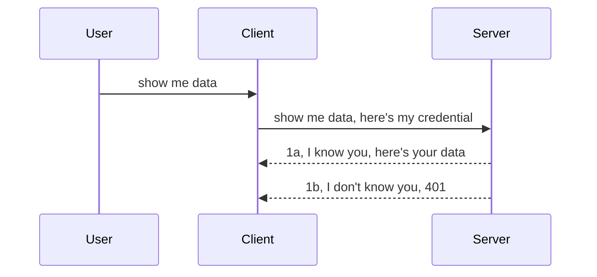

<!--
CO_OP_TRANSLATOR_METADATA:
{
  "original_hash": "5b00b8a8971a07d2d8803be4c9f138f8",
  "translation_date": "2025-10-07T00:56:45+00:00",
  "source_file": "03-GettingStarted/11-simple-auth/README.md",
  "language_code": "vi"
}
-->
# Xác thực đơn giản

Các SDK của MCP hỗ trợ sử dụng OAuth 2.1, một quy trình khá phức tạp liên quan đến các khái niệm như máy chủ xác thực, máy chủ tài nguyên, gửi thông tin đăng nhập, nhận mã, đổi mã lấy mã thông báo bearer cho đến khi bạn có thể truy cập dữ liệu tài nguyên của mình. Nếu bạn chưa quen với OAuth, một công nghệ tuyệt vời để triển khai, thì việc bắt đầu với một mức độ xác thực cơ bản và dần nâng cao bảo mật là một ý tưởng hay. Đó là lý do chương này tồn tại, để giúp bạn tiến tới các phương pháp xác thực nâng cao hơn.

## Xác thực, chúng ta đang nói về điều gì?

Xác thực là viết tắt của "authentication" (xác minh danh tính) và "authorization" (ủy quyền). Ý tưởng là chúng ta cần thực hiện hai việc:

- **Authentication**: Quá trình xác định xem chúng ta có cho phép một người vào nhà hay không, rằng họ có quyền ở "đây", tức là có quyền truy cập vào máy chủ tài nguyên nơi các tính năng của MCP Server tồn tại.
- **Authorization**: Quá trình xác định xem người dùng có quyền truy cập vào các tài nguyên cụ thể mà họ yêu cầu hay không, ví dụ như các đơn hàng hoặc sản phẩm này, hoặc liệu họ có quyền đọc nội dung nhưng không được xóa, như một ví dụ khác.

## Thông tin đăng nhập: cách chúng ta cho hệ thống biết mình là ai

Hầu hết các nhà phát triển web thường nghĩ đến việc cung cấp thông tin đăng nhập cho máy chủ, thường là một bí mật để xác định xem họ có quyền truy cập hay không ("Authentication"). Thông tin đăng nhập này thường là phiên bản mã hóa base64 của tên người dùng và mật khẩu hoặc một khóa API xác định duy nhất một người dùng cụ thể.

Điều này liên quan đến việc gửi thông tin qua một header gọi là "Authorization" như sau:

```json
{ "Authorization": "secret123" }
```

Điều này thường được gọi là xác thực cơ bản. Cách hoạt động tổng thể sau đó diễn ra như sau:



Bây giờ chúng ta đã hiểu cách hoạt động từ góc độ luồng, làm thế nào để triển khai nó? Hầu hết các máy chủ web có một khái niệm gọi là middleware, một đoạn mã chạy như một phần của yêu cầu để xác minh thông tin đăng nhập, và nếu thông tin đăng nhập hợp lệ thì yêu cầu sẽ được phép tiếp tục. Nếu yêu cầu không có thông tin đăng nhập hợp lệ, bạn sẽ nhận được lỗi xác thực. Hãy xem cách điều này có thể được triển khai:

**Python**

```python
class AuthMiddleware(BaseHTTPMiddleware):
    async def dispatch(self, request, call_next):

        has_header = request.headers.get("Authorization")
        if not has_header:
            print("-> Missing Authorization header!")
            return Response(status_code=401, content="Unauthorized")

        if not valid_token(has_header):
            print("-> Invalid token!")
            return Response(status_code=403, content="Forbidden")

        print("Valid token, proceeding...")
       
        response = await call_next(request)
        # add any customer headers or change in the response in some way
        return response


starlette_app.add_middleware(CustomHeaderMiddleware)
```

Ở đây chúng ta đã:

- Tạo một middleware gọi là `AuthMiddleware` với phương thức `dispatch` được máy chủ web gọi.
- Thêm middleware vào máy chủ web:

    ```python
    starlette_app.add_middleware(AuthMiddleware)
    ```

- Viết logic xác minh kiểm tra xem header Authorization có tồn tại hay không và liệu bí mật được gửi có hợp lệ hay không:

    ```python
    has_header = request.headers.get("Authorization")
    if not has_header:
        print("-> Missing Authorization header!")
        return Response(status_code=401, content="Unauthorized")

    if not valid_token(has_header):
        print("-> Invalid token!")
        return Response(status_code=403, content="Forbidden")
    ```

    Nếu bí mật tồn tại và hợp lệ, chúng ta cho phép yêu cầu tiếp tục bằng cách gọi `call_next` và trả về phản hồi.

    ```python
    response = await call_next(request)
    # add any customer headers or change in the response in some way
    return response
    ```

Cách hoạt động là nếu một yêu cầu web được gửi đến máy chủ, middleware sẽ được gọi và dựa trên cách triển khai của nó, yêu cầu sẽ được phép tiếp tục hoặc trả về lỗi cho biết rằng client không được phép tiếp tục.

**TypeScript**

Ở đây chúng ta tạo một middleware với framework phổ biến Express và chặn yêu cầu trước khi nó đến MCP Server. Đây là đoạn mã:

```typescript
function isValid(secret) {
    return secret === "secret123";
}

app.use((req, res, next) => {
    // 1. Authorization header present?  
    if(!req.headers["Authorization"]) {
        res.status(401).send('Unauthorized');
    }
    
    let token = req.headers["Authorization"];

    // 2. Check validity.
    if(!isValid(token)) {
        res.status(403).send('Forbidden');
    }

   
    console.log('Middleware executed');
    // 3. Passes request to the next step in the request pipeline.
    next();
});
```

Trong đoạn mã này, chúng ta:

1. Kiểm tra xem header Authorization có tồn tại hay không, nếu không, chúng ta gửi lỗi 401.
2. Đảm bảo thông tin đăng nhập/mã thông báo hợp lệ, nếu không, chúng ta gửi lỗi 403.
3. Cuối cùng, cho phép yêu cầu tiếp tục trong pipeline yêu cầu và trả về tài nguyên được yêu cầu.

## Bài tập: Triển khai xác thực

Hãy lấy kiến thức của chúng ta và thử triển khai nó. Đây là kế hoạch:

Máy chủ

- Tạo một máy chủ web và MCP instance.
- Triển khai một middleware cho máy chủ.

Client 

- Gửi yêu cầu web, kèm thông tin đăng nhập, qua header.

### -1- Tạo một máy chủ web và MCP instance

Trong bước đầu tiên, chúng ta cần tạo instance máy chủ web và MCP Server.

**Python**

Ở đây chúng ta tạo một instance MCP Server, tạo một ứng dụng web starlette và host nó với uvicorn.

```python
# creating MCP Server

app = FastMCP(
    name="MCP Resource Server",
    instructions="Resource Server that validates tokens via Authorization Server introspection",
    host=settings["host"],
    port=settings["port"],
    debug=True
)

# creating starlette web app
starlette_app = app.streamable_http_app()

# serving app via uvicorn
async def run(starlette_app):
    import uvicorn
    config = uvicorn.Config(
            starlette_app,
            host=app.settings.host,
            port=app.settings.port,
            log_level=app.settings.log_level.lower(),
        )
    server = uvicorn.Server(config)
    await server.serve()

run(starlette_app)
```

Trong đoạn mã này, chúng ta:

- Tạo MCP Server.
- Xây dựng ứng dụng web starlette từ MCP Server, `app.streamable_http_app()`.
- Host và phục vụ ứng dụng web bằng uvicorn `server.serve()`.

**TypeScript**

Ở đây chúng ta tạo một instance MCP Server.

```typescript
const server = new McpServer({
      name: "example-server",
      version: "1.0.0"
    });

    // ... set up server resources, tools, and prompts ...
```

Việc tạo MCP Server này cần được thực hiện trong định nghĩa route POST /mcp của chúng ta, vì vậy hãy lấy đoạn mã trên và di chuyển nó như sau:

```typescript
import express from "express";
import { randomUUID } from "node:crypto";
import { McpServer } from "@modelcontextprotocol/sdk/server/mcp.js";
import { StreamableHTTPServerTransport } from "@modelcontextprotocol/sdk/server/streamableHttp.js";
import { isInitializeRequest } from "@modelcontextprotocol/sdk/types.js"

const app = express();
app.use(express.json());

// Map to store transports by session ID
const transports: { [sessionId: string]: StreamableHTTPServerTransport } = {};

// Handle POST requests for client-to-server communication
app.post('/mcp', async (req, res) => {
  // Check for existing session ID
  const sessionId = req.headers['mcp-session-id'] as string | undefined;
  let transport: StreamableHTTPServerTransport;

  if (sessionId && transports[sessionId]) {
    // Reuse existing transport
    transport = transports[sessionId];
  } else if (!sessionId && isInitializeRequest(req.body)) {
    // New initialization request
    transport = new StreamableHTTPServerTransport({
      sessionIdGenerator: () => randomUUID(),
      onsessioninitialized: (sessionId) => {
        // Store the transport by session ID
        transports[sessionId] = transport;
      },
      // DNS rebinding protection is disabled by default for backwards compatibility. If you are running this server
      // locally, make sure to set:
      // enableDnsRebindingProtection: true,
      // allowedHosts: ['127.0.0.1'],
    });

    // Clean up transport when closed
    transport.onclose = () => {
      if (transport.sessionId) {
        delete transports[transport.sessionId];
      }
    };
    const server = new McpServer({
      name: "example-server",
      version: "1.0.0"
    });

    // ... set up server resources, tools, and prompts ...

    // Connect to the MCP server
    await server.connect(transport);
  } else {
    // Invalid request
    res.status(400).json({
      jsonrpc: '2.0',
      error: {
        code: -32000,
        message: 'Bad Request: No valid session ID provided',
      },
      id: null,
    });
    return;
  }

  // Handle the request
  await transport.handleRequest(req, res, req.body);
});

// Reusable handler for GET and DELETE requests
const handleSessionRequest = async (req: express.Request, res: express.Response) => {
  const sessionId = req.headers['mcp-session-id'] as string | undefined;
  if (!sessionId || !transports[sessionId]) {
    res.status(400).send('Invalid or missing session ID');
    return;
  }
  
  const transport = transports[sessionId];
  await transport.handleRequest(req, res);
};

// Handle GET requests for server-to-client notifications via SSE
app.get('/mcp', handleSessionRequest);

// Handle DELETE requests for session termination
app.delete('/mcp', handleSessionRequest);

app.listen(3000);
```

Bây giờ bạn thấy cách tạo MCP Server được di chuyển vào trong `app.post("/mcp")`.

Hãy chuyển sang bước tiếp theo là tạo middleware để chúng ta có thể xác minh thông tin đăng nhập gửi đến.

### -2- Triển khai một middleware cho máy chủ

Tiếp theo, chúng ta sẽ tạo một middleware tìm kiếm thông tin đăng nhập trong header `Authorization` và xác minh nó. Nếu thông tin đăng nhập hợp lệ, yêu cầu sẽ tiếp tục thực hiện những gì nó cần (ví dụ: liệt kê công cụ, đọc tài nguyên hoặc bất kỳ chức năng MCP nào mà client yêu cầu).

**Python**

Để tạo middleware, chúng ta cần tạo một lớp kế thừa từ `BaseHTTPMiddleware`. Có hai phần thú vị:

- Yêu cầu `request`, mà chúng ta đọc thông tin từ header.
- `call_next`, callback mà chúng ta cần gọi nếu client cung cấp thông tin đăng nhập mà chúng ta chấp nhận.

Đầu tiên, chúng ta cần xử lý trường hợp nếu header `Authorization` bị thiếu:

```python
has_header = request.headers.get("Authorization")

# no header present, fail with 401, otherwise move on.
if not has_header:
    print("-> Missing Authorization header!")
    return Response(status_code=401, content="Unauthorized")
```

Ở đây chúng ta gửi thông báo 401 không được phép vì client không vượt qua xác thực.

Tiếp theo, nếu một thông tin đăng nhập được gửi, chúng ta cần kiểm tra tính hợp lệ của nó như sau:

```python
 if not valid_token(has_header):
    print("-> Invalid token!")
    return Response(status_code=403, content="Forbidden")
```

Lưu ý cách chúng ta gửi thông báo 403 bị cấm ở trên. Hãy xem toàn bộ middleware dưới đây triển khai mọi thứ chúng ta đã đề cập:

```python
class AuthMiddleware(BaseHTTPMiddleware):
    async def dispatch(self, request, call_next):

        has_header = request.headers.get("Authorization")
        if not has_header:
            print("-> Missing Authorization header!")
            return Response(status_code=401, content="Unauthorized")

        if not valid_token(has_header):
            print("-> Invalid token!")
            return Response(status_code=403, content="Forbidden")

        print("Valid token, proceeding...")
        print(f"-> Received {request.method} {request.url}")
        response = await call_next(request)
        response.headers['Custom'] = 'Example'
        return response

```

Tuyệt vời, nhưng còn hàm `valid_token` thì sao? Đây là nó:

```python
# DON'T use for production - improve it !!
def valid_token(token: str) -> bool:
    # remove the "Bearer " prefix
    if token.startswith("Bearer "):
        token = token[7:]
        return token == "secret-token"
    return False
```

Điều này rõ ràng cần được cải thiện.

QUAN TRỌNG: Bạn KHÔNG BAO GIỜ nên lưu trữ các bí mật như thế này trong mã. Bạn nên lấy giá trị để so sánh từ một nguồn dữ liệu hoặc từ một IDP (nhà cung cấp dịch vụ danh tính) hoặc tốt hơn nữa, để IDP thực hiện việc xác minh.

**TypeScript**

Để triển khai điều này với Express, chúng ta cần gọi phương thức `use` nhận các hàm middleware.

Chúng ta cần:

- Tương tác với biến yêu cầu để kiểm tra thông tin đăng nhập được gửi trong thuộc tính `Authorization`.
- Xác minh thông tin đăng nhập, và nếu hợp lệ, cho phép yêu cầu tiếp tục và để yêu cầu MCP của client thực hiện những gì nó cần (ví dụ: liệt kê công cụ, đọc tài nguyên hoặc bất kỳ MCP nào liên quan).

Ở đây, chúng ta kiểm tra xem header `Authorization` có tồn tại hay không và nếu không, chúng ta dừng yêu cầu:

```typescript
if(!req.headers["authorization"]) {
    res.status(401).send('Unauthorized');
    return;
}
```

Nếu header không được gửi, bạn sẽ nhận được lỗi 401.

Tiếp theo, chúng ta kiểm tra xem thông tin đăng nhập có hợp lệ hay không, nếu không, chúng ta lại dừng yêu cầu nhưng với một thông báo hơi khác:

```typescript
if(!isValid(token)) {
    res.status(403).send('Forbidden');
    return;
} 
```

Lưu ý cách bạn nhận được lỗi 403 ở đây.

Đây là toàn bộ đoạn mã:

```typescript
app.use((req, res, next) => {
    console.log('Request received:', req.method, req.url, req.headers);
    console.log('Headers:', req.headers["authorization"]);
    if(!req.headers["authorization"]) {
        res.status(401).send('Unauthorized');
        return;
    }
    
    let token = req.headers["authorization"];

    if(!isValid(token)) {
        res.status(403).send('Forbidden');
        return;
    }  

    console.log('Middleware executed');
    next();
});
```

Chúng ta đã thiết lập máy chủ web để chấp nhận một middleware kiểm tra thông tin đăng nhập mà client hy vọng gửi cho chúng ta. Còn về chính client thì sao?

### -3- Gửi yêu cầu web với thông tin đăng nhập qua header

Chúng ta cần đảm bảo rằng client đang gửi thông tin đăng nhập qua header. Vì chúng ta sẽ sử dụng một MCP client để làm điều này, chúng ta cần tìm hiểu cách thực hiện.

**Python**

Đối với client, chúng ta cần gửi một header kèm thông tin đăng nhập như sau:

```python
# DON'T hardcode the value, have it at minimum in an environment variable or a more secure storage
token = "secret-token"

async with streamablehttp_client(
        url = f"http://localhost:{port}/mcp",
        headers = {"Authorization": f"Bearer {token}"}
    ) as (
        read_stream,
        write_stream,
        session_callback,
    ):
        async with ClientSession(
            read_stream,
            write_stream
        ) as session:
            await session.initialize()
      
            # TODO, what you want done in the client, e.g list tools, call tools etc.
```

Lưu ý cách chúng ta điền thuộc tính `headers` như sau: `headers = {"Authorization": f"Bearer {token}"}`.

**TypeScript**

Chúng ta có thể giải quyết điều này trong hai bước:

1. Điền một đối tượng cấu hình với thông tin đăng nhập của chúng ta.
2. Gửi đối tượng cấu hình đến transport.

```typescript

// DON'T hardcode the value like shown here. At minimum have it as a env variable and use something like dotenv (in dev mode).
let token = "secret123"

// define a client transport option object
let options: StreamableHTTPClientTransportOptions = {
  sessionId: sessionId,
  requestInit: {
    headers: {
      "Authorization": "secret123"
    }
  }
};

// pass the options object to the transport
async function main() {
   const transport = new StreamableHTTPClientTransport(
      new URL(serverUrl),
      options
   );
```

Ở đây bạn thấy cách chúng ta tạo một đối tượng `options` và đặt header của chúng ta dưới thuộc tính `requestInit`.

QUAN TRỌNG: Làm thế nào để cải thiện từ đây? Hiện tại, việc gửi thông tin đăng nhập như thế này khá rủi ro trừ khi bạn ít nhất sử dụng HTTPS. Ngay cả khi đó, thông tin đăng nhập có thể bị đánh cắp, vì vậy bạn cần một hệ thống mà bạn có thể dễ dàng thu hồi mã thông báo và thêm các kiểm tra bổ sung như nơi yêu cầu đến từ đâu, liệu yêu cầu có xảy ra quá thường xuyên (hành vi giống bot), nói ngắn gọn, có rất nhiều mối quan tâm cần giải quyết.

Tuy nhiên, đối với các API rất đơn giản nơi bạn không muốn bất kỳ ai gọi API của mình mà không được xác thực, những gì chúng ta có ở đây là một khởi đầu tốt.

Với điều đó, hãy thử tăng cường bảo mật một chút bằng cách sử dụng định dạng tiêu chuẩn như JSON Web Token, còn được gọi là JWT hoặc mã thông báo "JOT".

## JSON Web Tokens, JWT

Vậy, chúng ta đang cố gắng cải thiện từ việc gửi thông tin đăng nhập rất đơn giản. Những cải tiến ngay lập tức mà chúng ta nhận được khi áp dụng JWT là gì?

- **Cải thiện bảo mật**. Trong xác thực cơ bản, bạn gửi tên người dùng và mật khẩu dưới dạng mã thông báo mã hóa base64 (hoặc bạn gửi một khóa API) lặp đi lặp lại, điều này làm tăng rủi ro. Với JWT, bạn gửi tên người dùng và mật khẩu và nhận được một mã thông báo trả về, mã thông báo này cũng có thời hạn, nghĩa là nó sẽ hết hạn. JWT cho phép bạn dễ dàng sử dụng kiểm soát truy cập chi tiết bằng cách sử dụng vai trò, phạm vi và quyền.
- **Tính không trạng thái và khả năng mở rộng**. JWT là tự chứa, chúng mang tất cả thông tin người dùng và loại bỏ nhu cầu lưu trữ phiên máy chủ. Mã thông báo cũng có thể được xác minh cục bộ.
- **Khả năng tương tác và liên kết**. JWT là trung tâm của Open ID Connect và được sử dụng với các nhà cung cấp danh tính nổi tiếng như Entra ID, Google Identity và Auth0. Chúng cũng cho phép sử dụng đăng nhập một lần và nhiều tính năng khác, làm cho nó phù hợp với doanh nghiệp.
- **Tính mô-đun và linh hoạt**. JWT cũng có thể được sử dụng với các API Gateway như Azure API Management, NGINX và nhiều hơn nữa. Nó cũng hỗ trợ các kịch bản xác thực và giao tiếp giữa các máy chủ, bao gồm các kịch bản mạo danh và ủy quyền.
- **Hiệu suất và bộ nhớ đệm**. JWT có thể được lưu trong bộ nhớ đệm sau khi giải mã, điều này giảm nhu cầu phân tích cú pháp. Điều này đặc biệt hữu ích với các ứng dụng có lưu lượng truy cập cao vì nó cải thiện thông lượng và giảm tải trên cơ sở hạ tầng bạn chọn.
- **Các tính năng nâng cao**. Nó cũng hỗ trợ introspection (kiểm tra tính hợp lệ trên máy chủ) và revocation (làm cho mã thông token không hợp lệ).

Với tất cả những lợi ích này, hãy xem cách chúng ta có thể đưa triển khai của mình lên cấp độ tiếp theo.

## Chuyển từ xác thực cơ bản sang JWT

Vậy, những thay đổi chúng ta cần thực hiện ở mức độ cao là:

- **Học cách tạo mã thông báo JWT** và chuẩn bị để gửi từ client đến server.
- **Xác minh mã thông token JWT**, và nếu hợp lệ, cho phép client truy cập tài nguyên của chúng ta.
- **Lưu trữ mã thông báo an toàn**. Cách chúng ta lưu trữ mã thông báo này.
- **Bảo vệ các route**. Chúng ta cần bảo vệ các route, trong trường hợp của chúng ta, cần bảo vệ các route và các tính năng MCP cụ thể.
- **Thêm mã thông báo làm mới**. Đảm bảo chúng ta tạo mã thông báo ngắn hạn nhưng mã thông token làm mới dài hạn có thể được sử dụng để lấy mã thông báo mới nếu chúng hết hạn. Cũng đảm bảo có một endpoint làm mới và chiến lược xoay vòng.

### -1- Tạo mã thông báo JWT

Trước tiên, một mã thông báo JWT có các phần sau:

- **header**, thuật toán được sử dụng và loại mã thông báo.
- **payload**, các claim, như sub (người dùng hoặc thực thể mà mã thông báo đại diện. Trong kịch bản xác thực, điều này thường là userid), exp (khi nó hết hạn), role (vai trò).
- **signature**, được ký bằng một bí mật hoặc khóa riêng.

Để làm điều này, chúng ta cần tạo header, payload và mã thông báo được mã hóa.

**Python**

```python

import jwt
import jwt
from jwt.exceptions import ExpiredSignatureError, InvalidTokenError
import datetime

# Secret key used to sign the JWT
secret_key = 'your-secret-key'

header = {
    "alg": "HS256",
    "typ": "JWT"
}

# the user info andits claims and expiry time
payload = {
    "sub": "1234567890",               # Subject (user ID)
    "name": "User Userson",                # Custom claim
    "admin": True,                     # Custom claim
    "iat": datetime.datetime.utcnow(),# Issued at
    "exp": datetime.datetime.utcnow() + datetime.timedelta(hours=1)  # Expiry
}

# encode it
encoded_jwt = jwt.encode(payload, secret_key, algorithm="HS256", headers=header)
```

Trong đoạn mã trên, chúng ta đã:

- Định nghĩa một header sử dụng HS256 làm thuật toán và loại là JWT.
- Tạo một payload chứa một subject hoặc userid, một username, một role, thời điểm nó được phát hành và thời điểm nó hết hạn, do đó triển khai khía cạnh thời gian mà chúng ta đã đề cập trước đó.

**TypeScript**

Ở đây chúng ta sẽ cần một số dependencies giúp chúng ta tạo mã thông báo JWT.

Dependencies

```sh

npm install jsonwebtoken
npm install --save-dev @types/jsonwebtoken
```

Bây giờ chúng ta đã có điều đó, hãy tạo header, payload và thông qua đó tạo mã thông báo được mã hóa.

```typescript
import jwt from 'jsonwebtoken';

const secretKey = 'your-secret-key'; // Use env vars in production

// Define the payload
const payload = {
  sub: '1234567890',
  name: 'User usersson',
  admin: true,
  iat: Math.floor(Date.now() / 1000), // Issued at
  exp: Math.floor(Date.now() / 1000) + 60 * 60 // Expires in 1 hour
};

// Define the header (optional, jsonwebtoken sets defaults)
const header = {
  alg: 'HS256',
  typ: 'JWT'
};

// Create the token
const token = jwt.sign(payload, secretKey, {
  algorithm: 'HS256',
  header: header
});

console.log('JWT:', token);
```

Mã thông báo này:

Được ký bằng HS256  
Có hiệu lực trong 1 giờ  
Bao gồm các claim như sub, name, admin, iat, và exp.

### -2- Xác minh mã thông báo

Chúng ta cũng cần xác minh mã thông báo, điều này nên được thực hiện trên máy chủ để đảm bảo những gì client gửi cho chúng ta thực sự hợp lệ. Có nhiều kiểm tra chúng ta nên thực hiện ở đây từ việc xác minh cấu trúc của nó đến tính hợp lệ của nó. Bạn cũng được khuyến khích thêm các kiểm tra khác để xem liệu người dùng có trong hệ thống của bạn hay không và nhiều hơn nữa.

Để xác minh mã thông báo, chúng ta cần giải mã nó để có thể đọc và sau đó bắt đầu kiểm tra tính hợp lệ của nó:

**Python**

```python

# Decode and verify the JWT
try:
    decoded = jwt.decode(token, secret_key, algorithms=["HS256"])
    print("✅ Token is valid.")
    print("Decoded claims:")
    for key, value in decoded.items():
        print(f"  {key}: {value}")
except ExpiredSignatureError:
    print("❌ Token has expired.")
except InvalidTokenError as e:
    print(f"❌ Invalid token: {e}")

```

Trong đoạn mã này, chúng ta gọi `jwt.decode` sử dụng mã thông báo, khóa bí mật và thuật toán đã chọn làm đầu vào. Lưu ý cách chúng ta sử dụng cấu trúc try-catch vì việc xác minh thất bại dẫn đến lỗi được đưa ra.

**TypeScript**

Ở đây chúng ta cần gọi `jwt.verify` để nhận phiên bản giải mã của mã thông báo mà chúng ta có thể phân tích thêm. Nếu cuộc gọi này thất bại, điều đó có nghĩa là cấu trúc của mã thông báo không chính xác hoặc nó không còn hợp lệ.

```typescript

try {
  const decoded = jwt.verify(token, secretKey);
  console.log('Decoded Payload:', decoded);
} catch (err) {
  console.error('Token verification failed:', err);
}
```

LƯU Ý: như đã đề cập trước đó, chúng ta nên thực hiện các kiểm tra bổ sung để đảm bảo mã thông báo này chỉ ra một người dùng trong hệ thống của chúng ta và đảm bảo người dùng có các quyền mà nó tuyên bố có.
Tiếp theo, hãy cùng tìm hiểu về kiểm soát truy cập dựa trên vai trò, còn được gọi là RBAC.

## Thêm kiểm soát truy cập dựa trên vai trò

Ý tưởng là chúng ta muốn thể hiện rằng các vai trò khác nhau có các quyền khác nhau. Ví dụ, chúng ta giả định rằng một admin có thể làm mọi thứ, người dùng bình thường có thể đọc/ghi, và khách chỉ có thể đọc. Vì vậy, đây là một số mức quyền có thể có:

- Admin.Write 
- User.Read
- Guest.Read

Hãy xem cách chúng ta có thể triển khai loại kiểm soát này bằng middleware. Middleware có thể được thêm vào từng route cũng như cho tất cả các route.

**Python**

```python
from starlette.middleware.base import BaseHTTPMiddleware
from starlette.responses import JSONResponse
import jwt

# DON'T have the secret in the code like, this is for demonstration purposes only. Read it from a safe place.
SECRET_KEY = "your-secret-key" # put this in env variable
REQUIRED_PERMISSION = "User.Read"

class JWTPermissionMiddleware(BaseHTTPMiddleware):
    async def dispatch(self, request, call_next):
        auth_header = request.headers.get("Authorization")
        if not auth_header or not auth_header.startswith("Bearer "):
            return JSONResponse({"error": "Missing or invalid Authorization header"}, status_code=401)

        token = auth_header.split(" ")[1]
        try:
            decoded = jwt.decode(token, SECRET_KEY, algorithms=["HS256"])
        except jwt.ExpiredSignatureError:
            return JSONResponse({"error": "Token expired"}, status_code=401)
        except jwt.InvalidTokenError:
            return JSONResponse({"error": "Invalid token"}, status_code=401)

        permissions = decoded.get("permissions", [])
        if REQUIRED_PERMISSION not in permissions:
            return JSONResponse({"error": "Permission denied"}, status_code=403)

        request.state.user = decoded
        return await call_next(request)


```

Có một vài cách khác nhau để thêm middleware như dưới đây:

```python

# Alt 1: add middleware while constructing starlette app
middleware = [
    Middleware(JWTPermissionMiddleware)
]

app = Starlette(routes=routes, middleware=middleware)

# Alt 2: add middleware after starlette app is a already constructed
starlette_app.add_middleware(JWTPermissionMiddleware)

# Alt 3: add middleware per route
routes = [
    Route(
        "/mcp",
        endpoint=..., # handler
        middleware=[Middleware(JWTPermissionMiddleware)]
    )
]
```

**TypeScript**

Chúng ta có thể sử dụng `app.use` và một middleware sẽ chạy cho tất cả các yêu cầu.

```typescript
app.use((req, res, next) => {
    console.log('Request received:', req.method, req.url, req.headers);
    console.log('Headers:', req.headers["authorization"]);

    // 1. Check if authorization header has been sent

    if(!req.headers["authorization"]) {
        res.status(401).send('Unauthorized');
        return;
    }
    
    let token = req.headers["authorization"];

    // 2. Check if token is valid
    if(!isValid(token)) {
        res.status(403).send('Forbidden');
        return;
    }  

    // 3. Check if token user exist in our system
    if(!isExistingUser(token)) {
        res.status(403).send('Forbidden');
        console.log("User does not exist");
        return;
    }
    console.log("User exists");

    // 4. Verify the token has the right permissions
    if(!hasScopes(token, ["User.Read"])){
        res.status(403).send('Forbidden - insufficient scopes');
    }

    console.log("User has required scopes");

    console.log('Middleware executed');
    next();
});

```

Có khá nhiều điều mà middleware của chúng ta có thể làm và NÊN làm, cụ thể là:

1. Kiểm tra xem có header authorization hay không.
2. Kiểm tra xem token có hợp lệ không, chúng ta gọi `isValid`, đây là một phương thức mà chúng ta đã viết để kiểm tra tính toàn vẹn và tính hợp lệ của token JWT.
3. Xác minh người dùng có tồn tại trong hệ thống của chúng ta, chúng ta nên kiểm tra điều này.

   ```typescript
    // users in DB
   const users = [
     "user1",
     "User usersson",
   ]

   function isExistingUser(token) {
     let decodedToken = verifyToken(token);

     // TODO, check if user exists in DB
     return users.includes(decodedToken?.name || "");
   }
   ```

   Ở trên, chúng ta đã tạo một danh sách `users` rất đơn giản, danh sách này rõ ràng nên được lưu trong cơ sở dữ liệu.

4. Ngoài ra, chúng ta cũng nên kiểm tra xem token có quyền phù hợp hay không.

   ```typescript
   if(!hasScopes(token, ["User.Read"])){
        res.status(403).send('Forbidden - insufficient scopes');
   }
   ```

   Trong đoạn mã trên từ middleware, chúng ta kiểm tra rằng token chứa quyền User.Read, nếu không, chúng ta gửi lỗi 403. Dưới đây là phương thức trợ giúp `hasScopes`.

   ```typescript
   function hasScopes(scope: string, requiredScopes: string[]) {
     let decodedToken = verifyToken(scope);
    return requiredScopes.every(scope => decodedToken?.scopes.includes(scope));
  }
   ```

Have a think which additional checks you should be doing, but these are the absolute minimum of checks you should be doing.

Using Express as a web framework is a common choice. There are helpers library when you use JWT so you can write less code.

- `express-jwt`, helper library that provides a middleware that helps decode your token.
- `express-jwt-permissions`, this provides a middleware `guard` that helps check if a certain permission is on the token.

Here's what these libraries can look like when used:

```typescript
const express = require('express');
const jwt = require('express-jwt');
const guard = require('express-jwt-permissions')();

const app = express();
const secretKey = 'your-secret-key'; // put this in env variable

// Decode JWT and attach to req.user
app.use(jwt({ secret: secretKey, algorithms: ['HS256'] }));

// Check for User.Read permission
app.use(guard.check('User.Read'));

// multiple permissions
// app.use(guard.check(['User.Read', 'Admin.Access']));

app.get('/protected', (req, res) => {
  res.json({ message: `Welcome ${req.user.name}` });
});

// Error handler
app.use((err, req, res, next) => {
  if (err.code === 'permission_denied') {
    return res.status(403).send('Forbidden');
  }
  next(err);
});

```

Bây giờ bạn đã thấy cách middleware có thể được sử dụng cho cả xác thực và ủy quyền, vậy còn MCP thì sao, nó có thay đổi cách chúng ta thực hiện xác thực không? Hãy tìm hiểu trong phần tiếp theo.

### -3- Thêm RBAC vào MCP

Bạn đã thấy cách thêm RBAC thông qua middleware, tuy nhiên, đối với MCP không có cách dễ dàng để thêm RBAC theo từng tính năng MCP, vậy chúng ta làm gì? Chúng ta chỉ cần thêm mã như thế này để kiểm tra trong trường hợp này liệu client có quyền gọi một công cụ cụ thể hay không:

Bạn có một vài lựa chọn khác nhau để thực hiện RBAC theo từng tính năng, đây là một số:

- Thêm kiểm tra cho từng công cụ, tài nguyên, hoặc prompt nơi bạn cần kiểm tra mức quyền.

   **Python**

   ```python
   @tool()
   def delete_product(id: int):
      try:
          check_permissions(role="Admin.Write", request)
      catch:
        pass # client failed authorization, raise authorization error
   ```

   **TypeScript**

   ```typescript
   server.registerTool(
    "delete-product",
    {
      title: Delete a product",
      description: "Deletes a product",
      inputSchema: { id: z.number() }
    },
    async ({ id }) => {
      
      try {
        checkPermissions("Admin.Write", request);
        // todo, send id to productService and remote entry
      } catch(Exception e) {
        console.log("Authorization error, you're not allowed");  
      }

      return {
        content: [{ type: "text", text: `Deletected product with id ${id}` }]
      };
    }
   );
   ```


- Sử dụng cách tiếp cận máy chủ nâng cao và các request handlers để giảm thiểu số lượng nơi bạn cần thực hiện kiểm tra.

   **Python**

   ```python
   
   tool_permission = {
      "create_product": ["User.Write", "Admin.Write"],
      "delete_product": ["Admin.Write"]
   }

   def has_permission(user_permissions, required_permissions) -> bool:
      # user_permissions: list of permissions the user has
      # required_permissions: list of permissions required for the tool
      return any(perm in user_permissions for perm in required_permissions)

   @server.call_tool()
   async def handle_call_tool(
     name: str, arguments: dict[str, str] | None
   ) -> list[types.TextContent]:
    # Assume request.user.permissions is a list of permissions for the user
     user_permissions = request.user.permissions
     required_permissions = tool_permission.get(name, [])
     if not has_permission(user_permissions, required_permissions):
        # Raise error "You don't have permission to call tool {name}"
        raise Exception(f"You don't have permission to call tool {name}")
     # carry on and call tool
     # ...
   ```   
   

   **TypeScript**

   ```typescript
   function hasPermission(userPermissions: string[], requiredPermissions: string[]): boolean {
       if (!Array.isArray(userPermissions) || !Array.isArray(requiredPermissions)) return false;
       // Return true if user has at least one required permission
       
       return requiredPermissions.some(perm => userPermissions.includes(perm));
   }
  
   server.setRequestHandler(CallToolRequestSchema, async (request) => {
      const { params: { name } } = request;
  
      let permissions = request.user.permissions;
  
      if (!hasPermission(permissions, toolPermissions[name])) {
         return new Error(`You don't have permission to call ${name}`);
      }
  
      // carry on..
   });
   ```

   Lưu ý, bạn sẽ cần đảm bảo middleware của mình gán một token đã được giải mã vào thuộc tính user của request để đoạn mã trên trở nên đơn giản.

### Tóm tắt

Bây giờ chúng ta đã thảo luận cách thêm hỗ trợ cho RBAC nói chung và cho MCP nói riêng, đã đến lúc thử triển khai bảo mật của riêng bạn để đảm bảo bạn hiểu các khái niệm đã được trình bày.

## Bài tập 1: Xây dựng máy chủ MCP và client MCP sử dụng xác thực cơ bản

Ở đây bạn sẽ áp dụng những gì đã học được về việc gửi thông tin đăng nhập qua header.

## Giải pháp 1

[Giải pháp 1](./code/basic/README.md)

## Bài tập 2: Nâng cấp giải pháp từ Bài tập 1 để sử dụng JWT

Hãy lấy giải pháp đầu tiên nhưng lần này, chúng ta sẽ cải thiện nó.

Thay vì sử dụng Basic Auth, hãy sử dụng JWT.

## Giải pháp 2

[Giải pháp 2](./solution/jwt-solution/README.md)

## Thử thách

Thêm RBAC theo từng công cụ như chúng tôi đã mô tả trong phần "Thêm RBAC vào MCP".

## Tóm lược

Hy vọng bạn đã học được nhiều điều trong chương này, từ không có bảo mật nào, đến bảo mật cơ bản, đến JWT và cách nó có thể được thêm vào MCP.

Chúng ta đã xây dựng một nền tảng vững chắc với JWT tùy chỉnh, nhưng khi mở rộng, chúng ta sẽ chuyển sang mô hình nhận dạng dựa trên tiêu chuẩn. Việc áp dụng một IdP như Entra hoặc Keycloak cho phép chúng ta chuyển giao việc phát hành, xác thực và quản lý vòng đời của token cho một nền tảng đáng tin cậy — giúp chúng ta tập trung vào logic ứng dụng và trải nghiệm người dùng.

Về điều này, chúng ta có một [chương nâng cao về Entra](../../05-AdvancedTopics/mcp-security-entra/README.md)

---

**Tuyên bố miễn trừ trách nhiệm**:  
Tài liệu này đã được dịch bằng dịch vụ dịch thuật AI [Co-op Translator](https://github.com/Azure/co-op-translator). Mặc dù chúng tôi cố gắng đảm bảo độ chính xác, xin lưu ý rằng các bản dịch tự động có thể chứa lỗi hoặc không chính xác. Tài liệu gốc bằng ngôn ngữ bản địa nên được coi là nguồn thông tin chính thức. Đối với các thông tin quan trọng, khuyến nghị sử dụng dịch vụ dịch thuật chuyên nghiệp bởi con người. Chúng tôi không chịu trách nhiệm cho bất kỳ sự hiểu lầm hoặc diễn giải sai nào phát sinh từ việc sử dụng bản dịch này.