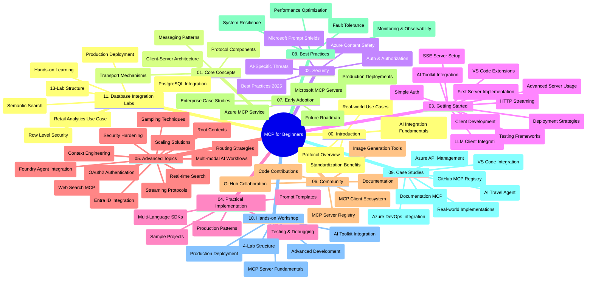

<!--
CO_OP_TRANSLATOR_METADATA:
{
  "original_hash": "af27b0acfae6caa134d9701453884df8",
  "translation_date": "2025-10-06T23:32:42+00:00",
  "source_file": "study_guide.md",
  "language_code": "vi"
}
-->
# Giao thức Ngữ cảnh Mô hình (MCP) cho Người mới bắt đầu - Hướng dẫn học tập

Hướng dẫn học tập này cung cấp tổng quan về cấu trúc và nội dung của kho lưu trữ dành cho chương trình học "Giao thức Ngữ cảnh Mô hình (MCP) cho Người mới bắt đầu". Sử dụng hướng dẫn này để điều hướng kho lưu trữ một cách hiệu quả và tận dụng tối đa các tài nguyên có sẵn.

## Tổng quan về Kho lưu trữ

Giao thức Ngữ cảnh Mô hình (MCP) là một khung tiêu chuẩn hóa cho các tương tác giữa các mô hình AI và ứng dụng khách. Ban đầu được tạo bởi Anthropic, MCP hiện được duy trì bởi cộng đồng MCP rộng lớn hơn thông qua tổ chức GitHub chính thức. Kho lưu trữ này cung cấp một chương trình học toàn diện với các ví dụ mã thực hành bằng C#, Java, JavaScript, Python và TypeScript, được thiết kế cho các nhà phát triển AI, kiến trúc sư hệ thống và kỹ sư phần mềm.

## Bản đồ Chương trình học Trực quan

## Cấu trúc Kho lưu trữ

Kho lưu trữ được tổ chức thành mười một phần chính, mỗi phần tập trung vào các khía cạnh khác nhau của MCP:

1. **Giới thiệu (00-Introduction/)**
   - Tổng quan về Giao thức Ngữ cảnh Mô hình
   - Tại sao tiêu chuẩn hóa lại quan trọng trong các quy trình AI
   - Các trường hợp sử dụng thực tế và lợi ích

2. **Khái niệm Cốt lõi (01-CoreConcepts/)**
   - Kiến trúc client-server
   - Các thành phần chính của giao thức
   - Các mẫu tin nhắn trong MCP

3. **Bảo mật (02-Security/)**
   - Các mối đe dọa bảo mật trong các hệ thống dựa trên MCP
   - Các thực hành tốt nhất để bảo mật triển khai
   - Chiến lược xác thực và ủy quyền
   - **Tài liệu Bảo mật Toàn diện**:
     - Thực hành Tốt nhất về Bảo mật MCP 2025
     - Hướng dẫn Triển khai An toàn Nội dung Azure
     - Kiểm soát và Kỹ thuật Bảo mật MCP
     - Tham khảo Nhanh về Thực hành Tốt nhất MCP
   - **Các Chủ đề Bảo mật Chính**:
     - Tấn công tiêm lệnh và đầu độc công cụ
     - Chiếm đoạt phiên và vấn đề đại diện nhầm lẫn
     - Lỗ hổng truyền token
     - Quyền hạn quá mức và kiểm soát truy cập
     - Bảo mật chuỗi cung ứng cho các thành phần AI
     - Tích hợp Microsoft Prompt Shields

4. **Bắt đầu (03-GettingStarted/)**
   - Thiết lập và cấu hình môi trường
   - Tạo các máy chủ và khách MCP cơ bản
   - Tích hợp với các ứng dụng hiện có
   - Bao gồm các phần:
     - Triển khai máy chủ đầu tiên
     - Phát triển khách
     - Tích hợp khách LLM
     - Tích hợp VS Code
     - Máy chủ Sự kiện Gửi (SSE)
     - Sử dụng máy chủ nâng cao
     - Truyền phát HTTP
     - Tích hợp AI Toolkit
     - Chiến lược kiểm thử
     - Hướng dẫn triển khai

5. **Triển khai Thực tế (04-PracticalImplementation/)**
   - Sử dụng SDK trên các ngôn ngữ lập trình khác nhau
   - Kỹ thuật gỡ lỗi, kiểm thử và xác thực
   - Tạo mẫu nhắc nhở và quy trình làm việc có thể tái sử dụng
   - Các dự án mẫu với ví dụ triển khai

6. **Chủ đề Nâng cao (05-AdvancedTopics/)**
   - Kỹ thuật kỹ thuật ngữ cảnh
   - Tích hợp tác nhân Foundry
   - Quy trình làm việc AI đa phương thức
   - Demo xác thực OAuth2
   - Khả năng tìm kiếm thời gian thực
   - Truyền phát thời gian thực
   - Triển khai ngữ cảnh gốc
   - Chiến lược định tuyến
   - Kỹ thuật lấy mẫu
   - Phương pháp mở rộng quy mô
   - Cân nhắc về bảo mật
   - Tích hợp bảo mật Entra ID
   - Tích hợp tìm kiếm web

7. **Đóng góp Cộng đồng (06-CommunityContributions/)**
   - Cách đóng góp mã và tài liệu
   - Hợp tác qua GitHub
   - Cải tiến và phản hồi từ cộng đồng
   - Sử dụng các khách MCP khác nhau (Claude Desktop, Cline, VSCode)
   - Làm việc với các máy chủ MCP phổ biến bao gồm tạo hình ảnh

8. **Bài học từ Việc Áp dụng Ban đầu (07-LessonsfromEarlyAdoption/)**
   - Các triển khai thực tế và câu chuyện thành công
   - Xây dựng và triển khai các giải pháp dựa trên MCP
   - Xu hướng và lộ trình tương lai
   - **Hướng dẫn Máy chủ MCP của Microsoft**: Hướng dẫn toàn diện về 10 máy chủ MCP sẵn sàng sản xuất của Microsoft bao gồm:
     - Máy chủ MCP Microsoft Learn Docs
     - Máy chủ MCP Azure (15+ kết nối chuyên biệt)
     - Máy chủ MCP GitHub
     - Máy chủ MCP Azure DevOps
     - Máy chủ MCP MarkItDown
     - Máy chủ MCP SQL Server
     - Máy chủ MCP Playwright
     - Máy chủ MCP Dev Box
     - Máy chủ MCP Azure AI Foundry
     - Máy chủ MCP Microsoft 365 Agents Toolkit

9. **Thực hành Tốt nhất (08-BestPractices/)**
   - Tối ưu hóa hiệu suất
   - Thiết kế các hệ thống MCP chịu lỗi
   - Chiến lược kiểm thử và khả năng phục hồi

10. **Nghiên cứu Tình huống (09-CaseStudy/)**
    - **Bảy nghiên cứu tình huống toàn diện** chứng minh tính linh hoạt của MCP trong các kịch bản đa dạng:
    - **Đại lý Du lịch AI Azure**: Điều phối đa tác nhân với Azure OpenAI và AI Search
    - **Tích hợp Azure DevOps**: Tự động hóa quy trình làm việc với cập nhật dữ liệu YouTube
    - **Truy xuất Tài liệu Thời gian Thực**: Khách console Python với truyền phát HTTP
    - **Trình tạo Kế hoạch Học tập Tương tác**: Ứng dụng web Chainlit với AI hội thoại
    - **Tài liệu Trong Trình soạn thảo**: Tích hợp VS Code với quy trình làm việc GitHub Copilot
    - **Quản lý API Azure**: Tích hợp API doanh nghiệp với tạo máy chủ MCP
    - **Đăng ký MCP GitHub**: Phát triển hệ sinh thái và nền tảng tích hợp tác nhân
    - Các ví dụ triển khai bao gồm tích hợp doanh nghiệp, năng suất nhà phát triển và phát triển hệ sinh thái

11. **Hội thảo Thực hành (10-StreamliningAIWorkflowsBuildingAnMCPServerWithAIToolkit/)**
    - Hội thảo thực hành toàn diện kết hợp MCP với AI Toolkit
    - Xây dựng các ứng dụng thông minh kết nối các mô hình AI với các công cụ thực tế
    - Các mô-đun thực hành bao gồm các nguyên tắc cơ bản, phát triển máy chủ tùy chỉnh và chiến lược triển khai sản xuất
    - **Cấu trúc Phòng thí nghiệm**:
      - Phòng thí nghiệm 1: Nguyên tắc cơ bản về Máy chủ MCP
      - Phòng thí nghiệm 2: Phát triển Máy chủ MCP Nâng cao
      - Phòng thí nghiệm 3: Tích hợp AI Toolkit
      - Phòng thí nghiệm 4: Triển khai và Mở rộng Quy mô Sản xuất
    - Phương pháp học tập dựa trên phòng thí nghiệm với hướng dẫn từng bước

12. **Phòng thí nghiệm Tích hợp Cơ sở dữ liệu Máy chủ MCP (11-MCPServerHandsOnLabs/)**
    - **Lộ trình học tập 13 phòng thí nghiệm toàn diện** để xây dựng các máy chủ MCP sẵn sàng sản xuất với tích hợp PostgreSQL
    - **Triển khai phân tích bán lẻ thực tế** sử dụng trường hợp sử dụng Zava Retail
    - **Mẫu cấp doanh nghiệp** bao gồm Bảo mật Cấp Hàng (RLS), tìm kiếm ngữ nghĩa và truy cập dữ liệu đa người thuê
    - **Cấu trúc Phòng thí nghiệm Hoàn chỉnh**:
      - **Phòng thí nghiệm 00-03: Nền tảng** - Giới thiệu, Kiến trúc, Bảo mật, Thiết lập Môi trường
      - **Phòng thí nghiệm 04-06: Xây dựng Máy chủ MCP** - Thiết kế Cơ sở dữ liệu, Triển khai Máy chủ MCP, Phát triển Công cụ
      - **Phòng thí nghiệm 07-09: Tính năng Nâng cao** - Tìm kiếm Ngữ nghĩa, Kiểm thử & Gỡ lỗi, Tích hợp VS Code
      - **Phòng thí nghiệm 10-12: Sản xuất & Thực hành Tốt nhất** - Triển khai, Giám sát, Tối ưu hóa
    - **Công nghệ Được Đề cập**: Khung FastMCP, PostgreSQL, Azure OpenAI, Azure Container Apps, Application Insights
    - **Kết quả Học tập**: Máy chủ MCP sẵn sàng sản xuất, mẫu tích hợp cơ sở dữ liệu, phân tích dựa trên AI, bảo mật doanh nghiệp

## Tài nguyên Bổ sung

Kho lưu trữ bao gồm các tài nguyên hỗ trợ:

- **Thư mục hình ảnh**: Chứa các sơ đồ và hình minh họa được sử dụng trong toàn bộ chương trình học
- **Bản dịch**: Hỗ trợ đa ngôn ngữ với các bản dịch tài liệu tự động
- **Tài nguyên MCP chính thức**:
  - [Tài liệu MCP](https://modelcontextprotocol.io/)
  - [Đặc tả MCP](https://spec.modelcontextprotocol.io/)
  - [Kho lưu trữ GitHub MCP](https://github.com/modelcontextprotocol)

## Cách sử dụng Kho lưu trữ này

1. **Học tập theo trình tự**: Theo dõi các chương theo thứ tự (00 đến 11) để có trải nghiệm học tập có cấu trúc.
2. **Tập trung vào ngôn ngữ cụ thể**: Nếu bạn quan tâm đến một ngôn ngữ lập trình cụ thể, hãy khám phá các thư mục mẫu để tìm các triển khai bằng ngôn ngữ ưa thích của bạn.
3. **Triển khai Thực tế**: Bắt đầu với phần "Bắt đầu" để thiết lập môi trường của bạn và tạo máy chủ và khách MCP đầu tiên.
4. **Khám phá Nâng cao**: Khi đã quen thuộc với các kiến thức cơ bản, hãy khám phá các chủ đề nâng cao để mở rộng kiến thức của bạn.
5. **Tham gia Cộng đồng**: Tham gia cộng đồng MCP thông qua các cuộc thảo luận trên GitHub và các kênh Discord để kết nối với các chuyên gia và nhà phát triển khác.

## Khách hàng và Công cụ MCP

Chương trình học bao gồm các khách hàng và công cụ MCP khác nhau:

1. **Khách hàng Chính thức**:
   - Visual Studio Code 
   - MCP trong Visual Studio Code
   - Claude Desktop
   - Claude trong VSCode 
   - Claude API

2. **Khách hàng Cộng đồng**:
   - Cline (dựa trên terminal)
   - Cursor (trình soạn thảo mã)
   - ChatMCP
   - Windsurf

3. **Công cụ Quản lý MCP**:
   - MCP CLI
   - MCP Manager
   - MCP Linker
   - MCP Router

## Các Máy chủ MCP Phổ biến

Kho lưu trữ giới thiệu các máy chủ MCP khác nhau, bao gồm:

1. **Máy chủ MCP Chính thức của Microsoft**:
   - Máy chủ MCP Microsoft Learn Docs
   - Máy chủ MCP Azure (15+ kết nối chuyên biệt)
   - Máy chủ MCP GitHub
   - Máy chủ MCP Azure DevOps
   - Máy chủ MCP MarkItDown
   - Máy chủ MCP SQL Server
   - Máy chủ MCP Playwright
   - Máy chủ MCP Dev Box
   - Máy chủ MCP Azure AI Foundry
   - Máy chủ MCP Microsoft 365 Agents Toolkit

2. **Máy chủ Tham chiếu Chính thức**:
   - Filesystem
   - Fetch
   - Memory
   - Sequential Thinking

3. **Tạo Hình ảnh**:
   - Azure OpenAI DALL-E 3
   - Stable Diffusion WebUI
   - Replicate

4. **Công cụ Phát triển**:
   - Git MCP
   - Terminal Control
   - Code Assistant

5. **Máy chủ Chuyên biệt**:
   - Salesforce
   - Microsoft Teams
   - Jira & Confluence

## Đóng góp

Kho lưu trữ này hoan nghênh các đóng góp từ cộng đồng. Xem phần Đóng góp Cộng đồng để biết hướng dẫn về cách đóng góp hiệu quả cho hệ sinh thái MCP.

----

*Hướng dẫn học tập này được cập nhật vào ngày 6 tháng 10 năm 2025 và cung cấp tổng quan về kho lưu trữ tính đến ngày đó. Nội dung kho lưu trữ có thể được cập nhật sau ngày này.*

---

**Tuyên bố miễn trừ trách nhiệm**:  
Tài liệu này đã được dịch bằng dịch vụ dịch thuật AI [Co-op Translator](https://github.com/Azure/co-op-translator). Mặc dù chúng tôi cố gắng đảm bảo độ chính xác, xin lưu ý rằng các bản dịch tự động có thể chứa lỗi hoặc không chính xác. Tài liệu gốc bằng ngôn ngữ bản địa nên được coi là nguồn thông tin chính thức. Đối với các thông tin quan trọng, khuyến nghị sử dụng dịch vụ dịch thuật chuyên nghiệp bởi con người. Chúng tôi không chịu trách nhiệm cho bất kỳ sự hiểu lầm hoặc diễn giải sai nào phát sinh từ việc sử dụng bản dịch này.