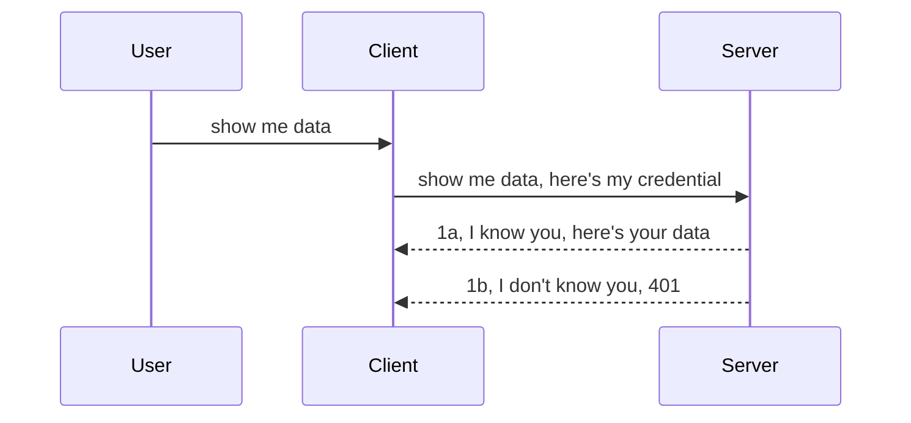

<!--
CO_OP_TRANSLATOR_METADATA:
{
  "original_hash": "5b00b8a8971a07d2d8803be4c9f138f8",
  "translation_date": "2025-10-07T00:34:54+00:00",
  "source_file": "03-GettingStarted/11-simple-auth/README.md",
  "language_code": "zh"
}
-->
# 简单认证

MCP SDK 支持使用 OAuth 2.1，虽然它是一个非常强大的认证方式，但涉及到认证服务器、资源服务器、提交凭据、获取代码、交换代码以获取持有者令牌，直到最终获取资源数据的过程。如果你对 OAuth 不熟悉（尽管它是一个非常值得实现的技术），建议从一些基础的认证方式开始，然后逐步提升安全性。这就是本章存在的原因——帮助你逐步掌握更高级的认证方法。

## 什么是认证？

认证是“Authentication”和“Authorization”的缩写。它的核心思想是我们需要完成两件事：

- **Authentication（身份验证）**：这是确认某人是否可以进入我们“家”的过程，确保他们有权访问我们的资源服务器，也就是 MCP 服务器功能所在的地方。
- **Authorization（授权）**：这是确认用户是否可以访问他们请求的特定资源的过程。例如，某些订单或产品，或者他们是否可以读取内容但不能删除内容。

## 凭据：我们如何告诉系统我们是谁

大多数 Web 开发人员通常会想到向服务器提供凭据，通常是一个秘密，用来表明他们是否有权访问资源（身份验证）。这种凭据通常是用户名和密码的 base64 编码版本，或者是唯一标识特定用户的 API 密钥。

这通常通过一个名为 "Authorization" 的头发送，如下所示：

```json
{ "Authorization": "secret123" }
```

这通常被称为基本认证。整体流程如下：



现在我们已经从流程的角度理解了它是如何工作的，那么如何实现呢？大多数 Web 服务器都有一个名为中间件的概念，这是请求的一部分代码，可以验证凭据。如果凭据有效，请求可以通过；如果请求没有有效凭据，则会收到认证错误。让我们看看如何实现：

**Python**

```python
class AuthMiddleware(BaseHTTPMiddleware):
    async def dispatch(self, request, call_next):

        has_header = request.headers.get("Authorization")
        if not has_header:
            print("-> Missing Authorization header!")
            return Response(status_code=401, content="Unauthorized")

        if not valid_token(has_header):
            print("-> Invalid token!")
            return Response(status_code=403, content="Forbidden")

        print("Valid token, proceeding...")
       
        response = await call_next(request)
        # add any customer headers or change in the response in some way
        return response


starlette_app.add_middleware(CustomHeaderMiddleware)
```

这里我们：

- 创建了一个名为 `AuthMiddleware` 的中间件，其 `dispatch` 方法由 Web 服务器调用。
- 将中间件添加到 Web 服务器：

    ```python
    starlette_app.add_middleware(AuthMiddleware)
    ```

- 编写了验证逻辑，检查是否存在 Authorization 头以及发送的秘密是否有效：

    ```python
    has_header = request.headers.get("Authorization")
    if not has_header:
        print("-> Missing Authorization header!")
        return Response(status_code=401, content="Unauthorized")

    if not valid_token(has_header):
        print("-> Invalid token!")
        return Response(status_code=403, content="Forbidden")
    ```

    如果秘密存在且有效，我们通过调用 `call_next` 让请求通过，并返回响应。

    ```python
    response = await call_next(request)
    # add any customer headers or change in the response in some way
    return response
    ```

其工作原理是，当向服务器发出 Web 请求时，中间件会被调用，根据其实现，它要么让请求通过，要么返回一个错误，表明客户端无权继续。

**TypeScript**

这里我们使用流行的框架 Express 创建一个中间件，在请求到达 MCP 服务器之前拦截它。代码如下：

```typescript
function isValid(secret) {
    return secret === "secret123";
}

app.use((req, res, next) => {
    // 1. Authorization header present?  
    if(!req.headers["Authorization"]) {
        res.status(401).send('Unauthorized');
    }
    
    let token = req.headers["Authorization"];

    // 2. Check validity.
    if(!isValid(token)) {
        res.status(403).send('Forbidden');
    }

   
    console.log('Middleware executed');
    // 3. Passes request to the next step in the request pipeline.
    next();
});
```

在这段代码中，我们：

1. 检查是否存在 Authorization 头，如果没有，则发送 401 错误。
2. 确保凭据/令牌有效，如果无效，则发送 403 错误。
3. 最后将请求传递到请求管道中，并返回所请求的资源。

## 练习：实现认证

让我们运用所学知识尝试实现它。计划如下：

服务器端

- 创建一个 Web 服务器和 MCP 实例。
- 为服务器实现一个中间件。

客户端

- 通过头发送带有凭据的 Web 请求。

### -1- 创建一个 Web 服务器和 MCP 实例

第一步，我们需要创建 Web 服务器实例和 MCP 服务器。

**Python**

这里我们创建一个 MCP 服务器实例，创建一个 starlette Web 应用，并使用 uvicorn 托管它。

```python
# creating MCP Server

app = FastMCP(
    name="MCP Resource Server",
    instructions="Resource Server that validates tokens via Authorization Server introspection",
    host=settings["host"],
    port=settings["port"],
    debug=True
)

# creating starlette web app
starlette_app = app.streamable_http_app()

# serving app via uvicorn
async def run(starlette_app):
    import uvicorn
    config = uvicorn.Config(
            starlette_app,
            host=app.settings.host,
            port=app.settings.port,
            log_level=app.settings.log_level.lower(),
        )
    server = uvicorn.Server(config)
    await server.serve()

run(starlette_app)
```

在这段代码中，我们：

- 创建了 MCP 服务器。
- 从 MCP 服务器构建了 starlette Web 应用，`app.streamable_http_app()`。
- 使用 uvicorn 托管并服务 Web 应用 `server.serve()`。

**TypeScript**

这里我们创建一个 MCP 服务器实例。

```typescript
const server = new McpServer({
      name: "example-server",
      version: "1.0.0"
    });

    // ... set up server resources, tools, and prompts ...
```

这个 MCP 服务器创建需要在我们的 POST /mcp 路由定义中进行，因此我们将上述代码移动如下：

```typescript
import express from "express";
import { randomUUID } from "node:crypto";
import { McpServer } from "@modelcontextprotocol/sdk/server/mcp.js";
import { StreamableHTTPServerTransport } from "@modelcontextprotocol/sdk/server/streamableHttp.js";
import { isInitializeRequest } from "@modelcontextprotocol/sdk/types.js"

const app = express();
app.use(express.json());

// Map to store transports by session ID
const transports: { [sessionId: string]: StreamableHTTPServerTransport } = {};

// Handle POST requests for client-to-server communication
app.post('/mcp', async (req, res) => {
  // Check for existing session ID
  const sessionId = req.headers['mcp-session-id'] as string | undefined;
  let transport: StreamableHTTPServerTransport;

  if (sessionId && transports[sessionId]) {
    // Reuse existing transport
    transport = transports[sessionId];
  } else if (!sessionId && isInitializeRequest(req.body)) {
    // New initialization request
    transport = new StreamableHTTPServerTransport({
      sessionIdGenerator: () => randomUUID(),
      onsessioninitialized: (sessionId) => {
        // Store the transport by session ID
        transports[sessionId] = transport;
      },
      // DNS rebinding protection is disabled by default for backwards compatibility. If you are running this server
      // locally, make sure to set:
      // enableDnsRebindingProtection: true,
      // allowedHosts: ['127.0.0.1'],
    });

    // Clean up transport when closed
    transport.onclose = () => {
      if (transport.sessionId) {
        delete transports[transport.sessionId];
      }
    };
    const server = new McpServer({
      name: "example-server",
      version: "1.0.0"
    });

    // ... set up server resources, tools, and prompts ...

    // Connect to the MCP server
    await server.connect(transport);
  } else {
    // Invalid request
    res.status(400).json({
      jsonrpc: '2.0',
      error: {
        code: -32000,
        message: 'Bad Request: No valid session ID provided',
      },
      id: null,
    });
    return;
  }

  // Handle the request
  await transport.handleRequest(req, res, req.body);
});

// Reusable handler for GET and DELETE requests
const handleSessionRequest = async (req: express.Request, res: express.Response) => {
  const sessionId = req.headers['mcp-session-id'] as string | undefined;
  if (!sessionId || !transports[sessionId]) {
    res.status(400).send('Invalid or missing session ID');
    return;
  }
  
  const transport = transports[sessionId];
  await transport.handleRequest(req, res);
};

// Handle GET requests for server-to-client notifications via SSE
app.get('/mcp', handleSessionRequest);

// Handle DELETE requests for session termination
app.delete('/mcp', handleSessionRequest);

app.listen(3000);
```

现在你可以看到 MCP 服务器创建被移动到了 `app.post("/mcp")` 中。

接下来我们创建中间件，以便验证传入的凭据。

### -2- 为服务器实现一个中间件

接下来是中间件部分。我们将创建一个中间件，检查 `Authorization` 头中的凭据并验证它。如果凭据可接受，请求将继续执行其需要的操作（例如列出工具、读取资源或客户端请求的任何 MCP 功能）。

**Python**

要创建中间件，我们需要创建一个继承自 `BaseHTTPMiddleware` 的类。这里有两个关键点：

- 请求 `request`，我们从中读取头信息。
- `call_next`，如果客户端提供了我们接受的凭据，我们需要调用的回调。

首先，我们需要处理 `Authorization` 头缺失的情况：

```python
has_header = request.headers.get("Authorization")

# no header present, fail with 401, otherwise move on.
if not has_header:
    print("-> Missing Authorization header!")
    return Response(status_code=401, content="Unauthorized")
```

这里我们发送了一个 401 未授权消息，因为客户端未通过身份验证。

接下来，如果提交了凭据，我们需要验证其有效性，如下所示：

```python
 if not valid_token(has_header):
    print("-> Invalid token!")
    return Response(status_code=403, content="Forbidden")
```

注意我们在上面发送了一个 403 禁止消息。下面是实现上述所有内容的完整中间件：

```python
class AuthMiddleware(BaseHTTPMiddleware):
    async def dispatch(self, request, call_next):

        has_header = request.headers.get("Authorization")
        if not has_header:
            print("-> Missing Authorization header!")
            return Response(status_code=401, content="Unauthorized")

        if not valid_token(has_header):
            print("-> Invalid token!")
            return Response(status_code=403, content="Forbidden")

        print("Valid token, proceeding...")
        print(f"-> Received {request.method} {request.url}")
        response = await call_next(request)
        response.headers['Custom'] = 'Example'
        return response

```

很好，但 `valid_token` 函数是什么样的呢？如下所示：

```python
# DON'T use for production - improve it !!
def valid_token(token: str) -> bool:
    # remove the "Bearer " prefix
    if token.startswith("Bearer "):
        token = token[7:]
        return token == "secret-token"
    return False
```

显然，这应该改进。

重要提示：绝对不要在代码中存储这样的秘密。理想情况下，你应该从数据源或 IDP（身份服务提供商）中检索比较值，或者更好的是，让 IDP 进行验证。

**TypeScript**

要使用 Express 实现这一点，我们需要调用 `use` 方法，该方法接受中间件函数。

我们需要：

- 与请求变量交互以检查 `Authorization` 属性中传递的凭据。
- 验证凭据，如果有效，让请求继续执行客户端的 MCP 请求（例如列出工具、读取资源或任何 MCP 相关操作）。

这里，我们检查是否存在 `Authorization` 头，如果没有，我们阻止请求通过：

```typescript
if(!req.headers["authorization"]) {
    res.status(401).send('Unauthorized');
    return;
}
```

如果头根本没有发送，你会收到 401 错误。

接下来，我们检查凭据是否有效，如果无效，我们再次阻止请求，但消息略有不同：

```typescript
if(!isValid(token)) {
    res.status(403).send('Forbidden');
    return;
} 
```

注意你现在会收到 403 错误。

以下是完整代码：

```typescript
app.use((req, res, next) => {
    console.log('Request received:', req.method, req.url, req.headers);
    console.log('Headers:', req.headers["authorization"]);
    if(!req.headers["authorization"]) {
        res.status(401).send('Unauthorized');
        return;
    }
    
    let token = req.headers["authorization"];

    if(!isValid(token)) {
        res.status(403).send('Forbidden');
        return;
    }  

    console.log('Middleware executed');
    next();
});
```

我们已经设置了 Web 服务器以接受中间件来检查客户端可能发送的凭据。那么客户端本身呢？

### -3- 通过头发送带有凭据的 Web 请求

我们需要确保客户端通过头传递凭据。由于我们将使用 MCP 客户端来实现这一点，我们需要弄清楚如何操作。

**Python**

对于客户端，我们需要通过头传递凭据，如下所示：

```python
# DON'T hardcode the value, have it at minimum in an environment variable or a more secure storage
token = "secret-token"

async with streamablehttp_client(
        url = f"http://localhost:{port}/mcp",
        headers = {"Authorization": f"Bearer {token}"}
    ) as (
        read_stream,
        write_stream,
        session_callback,
    ):
        async with ClientSession(
            read_stream,
            write_stream
        ) as session:
            await session.initialize()
      
            # TODO, what you want done in the client, e.g list tools, call tools etc.
```

注意我们如何填充 `headers` 属性：`headers = {"Authorization": f"Bearer {token}"}`。

**TypeScript**

我们可以通过两步解决：

1. 使用凭据填充配置对象。
2. 将配置对象传递给传输层。

```typescript

// DON'T hardcode the value like shown here. At minimum have it as a env variable and use something like dotenv (in dev mode).
let token = "secret123"

// define a client transport option object
let options: StreamableHTTPClientTransportOptions = {
  sessionId: sessionId,
  requestInit: {
    headers: {
      "Authorization": "secret123"
    }
  }
};

// pass the options object to the transport
async function main() {
   const transport = new StreamableHTTPClientTransport(
      new URL(serverUrl),
      options
   );
```

上面你可以看到我们如何创建一个 `options` 对象，并将我们的头放在 `requestInit` 属性下。

重要提示：如何从这里改进呢？当前实现存在一些问题。首先，除非至少使用 HTTPS，否则以这种方式传递凭据是非常危险的。即使使用 HTTPS，凭据也可能被窃取，因此你需要一个可以轻松撤销令牌的系统，并添加额外的检查，例如请求来自哪里、请求是否过于频繁（类似机器人行为）。简而言之，还有许多需要考虑的问题。

不过，对于非常简单的 API，如果你不希望任何人未经认证调用你的 API，那么我们目前的实现是一个不错的开始。

话虽如此，让我们尝试通过使用标准化格式（如 JSON Web Token，简称 JWT 或 "JOT" 令牌）来增强安全性。

## JSON Web Token (JWT)

我们尝试改进从发送简单凭据的方式。采用 JWT 后，我们能立即获得哪些改进？

- **安全性提升**：在基本认证中，你会反复发送用户名和密码作为 base64 编码令牌（或 API 密钥），这增加了风险。而使用 JWT，你发送用户名和密码后会获得一个令牌，该令牌是时间绑定的，意味着它会过期。JWT 还允许你轻松使用基于角色、范围和权限的细粒度访问控制。
- **无状态性和可扩展性**：JWT 是自包含的，携带所有用户信息，消除了存储服务器端会话的需求。令牌也可以在本地验证。
- **互操作性和联合身份**：JWT 是 Open ID Connect 的核心，并与知名身份提供商（如 Entra ID、Google Identity 和 Auth0）一起使用。它还支持单点登录等功能，使其达到企业级。
- **模块化和灵活性**：JWT 还可以与 API 网关（如 Azure API Management、NGINX 等）一起使用。它支持用户认证场景和服务器间通信，包括模拟和委托场景。
- **性能和缓存**：JWT 解码后可以缓存，从而减少解析需求。这对高流量应用尤其有帮助，因为它提高了吞吐量并减少了基础设施的负载。
- **高级功能**：它还支持内省（在服务器上检查有效性）和撤销（使令牌无效）。

有了这些好处，让我们看看如何将我们的实现提升到一个新的水平。

## 将基本认证转变为 JWT

我们需要进行以下更改：

- **学习构建 JWT 令牌**，并使其准备好从客户端发送到服务器。
- **验证 JWT 令牌**，如果有效，让客户端访问我们的资源。
- **安全存储令牌**，如何存储令牌。
- **保护路由**，我们需要保护路由，在我们的案例中，我们需要保护路由和特定的 MCP 功能。
- **添加刷新令牌**，确保我们创建短期有效的令牌，同时创建长期有效的刷新令牌，用于获取新令牌（如果令牌过期）。还需要确保有一个刷新端点和轮换策略。

### -1- 构建 JWT 令牌

首先，JWT 令牌包含以下部分：

- **header**：使用的算法和令牌类型。
- **payload**：声明，例如 sub（令牌代表的用户或实体，在认证场景中通常是用户 ID）、exp（过期时间）、role（角色）。
- **signature**：使用秘密或私钥签名。

为此，我们需要构建 header、payload 和编码令牌。

**Python**

```python

import jwt
import jwt
from jwt.exceptions import ExpiredSignatureError, InvalidTokenError
import datetime

# Secret key used to sign the JWT
secret_key = 'your-secret-key'

header = {
    "alg": "HS256",
    "typ": "JWT"
}

# the user info andits claims and expiry time
payload = {
    "sub": "1234567890",               # Subject (user ID)
    "name": "User Userson",                # Custom claim
    "admin": True,                     # Custom claim
    "iat": datetime.datetime.utcnow(),# Issued at
    "exp": datetime.datetime.utcnow() + datetime.timedelta(hours=1)  # Expiry
}

# encode it
encoded_jwt = jwt.encode(payload, secret_key, algorithm="HS256", headers=header)
```

在上述代码中，我们：

- 定义了一个 header，使用 HS256 作为算法，类型为 JWT。
- 构建了一个 payload，包含一个主题或用户 ID、用户名、角色、签发时间和过期时间，从而实现了我们之前提到的时间绑定特性。

**TypeScript**

这里我们需要一些依赖项来帮助我们构建 JWT 令牌。

依赖项

```sh

npm install jsonwebtoken
npm install --save-dev @types/jsonwebtoken
```

现在我们已经准备好，接下来创建 header、payload，并通过它们创建编码令牌。

```typescript
import jwt from 'jsonwebtoken';

const secretKey = 'your-secret-key'; // Use env vars in production

// Define the payload
const payload = {
  sub: '1234567890',
  name: 'User usersson',
  admin: true,
  iat: Math.floor(Date.now() / 1000), // Issued at
  exp: Math.floor(Date.now() / 1000) + 60 * 60 // Expires in 1 hour
};

// Define the header (optional, jsonwebtoken sets defaults)
const header = {
  alg: 'HS256',
  typ: 'JWT'
};

// Create the token
const token = jwt.sign(payload, secretKey, {
  algorithm: 'HS256',
  header: header
});

console.log('JWT:', token);
```

这个令牌：

使用 HS256 签名  
有效期为 1 小时  
包含声明，例如 sub、name、admin、iat 和 exp。

### -2- 验证令牌

我们还需要验证令牌，这应该在服务器端进行，以确保客户端发送的令牌确实有效。这里需要进行许多检查，从验证其结构到验证其有效性。建议添加其他检查，例如确认用户是否在你的系统中，以及用户是否拥有其声称的权限。

要验证令牌，我们需要解码它以便读取，然后开始检查其有效性：

**Python**

```python

# Decode and verify the JWT
try:
    decoded = jwt.decode(token, secret_key, algorithms=["HS256"])
    print("✅ Token is valid.")
    print("Decoded claims:")
    for key, value in decoded.items():
        print(f"  {key}: {value}")
except ExpiredSignatureError:
    print("❌ Token has expired.")
except InvalidTokenError as e:
    print(f"❌ Invalid token: {e}")

```

在这段代码中，我们调用 `jwt.decode`，使用令牌、密钥和选定的算法作为输入。注意我们使用了 try-catch 结构，因为验证失败会引发错误。

**TypeScript**

这里我们需要调用 `jwt.verify` 来获取令牌的解码版本，以便进一步分析。如果此调用失败，则表示令牌的结构不正确或已失效。

```typescript

try {
  const decoded = jwt.verify(token, secretKey);
  console.log('Decoded Payload:', decoded);
} catch (err) {
  console.error('Token verification failed:', err);
}
```

注意：如前所述，我们应该执行额外的检查，以确保此令牌指向系统中的用户，并确保用户拥有其声称的权限。
接下来，我们来了解基于角色的访问控制（RBAC）。

## 添加基于角色的访问控制

我们的目标是表达不同角色拥有不同的权限。例如，我们假设管理员可以执行所有操作，普通用户可以进行读写操作，而访客只能进行读取操作。因此，这里是一些可能的权限级别：

- Admin.Write 
- User.Read
- Guest.Read

让我们看看如何通过中间件实现这样的控制。中间件可以针对单个路由添加，也可以针对所有路由添加。

**Python**

```python
from starlette.middleware.base import BaseHTTPMiddleware
from starlette.responses import JSONResponse
import jwt

# DON'T have the secret in the code like, this is for demonstration purposes only. Read it from a safe place.
SECRET_KEY = "your-secret-key" # put this in env variable
REQUIRED_PERMISSION = "User.Read"

class JWTPermissionMiddleware(BaseHTTPMiddleware):
    async def dispatch(self, request, call_next):
        auth_header = request.headers.get("Authorization")
        if not auth_header or not auth_header.startswith("Bearer "):
            return JSONResponse({"error": "Missing or invalid Authorization header"}, status_code=401)

        token = auth_header.split(" ")[1]
        try:
            decoded = jwt.decode(token, SECRET_KEY, algorithms=["HS256"])
        except jwt.ExpiredSignatureError:
            return JSONResponse({"error": "Token expired"}, status_code=401)
        except jwt.InvalidTokenError:
            return JSONResponse({"error": "Invalid token"}, status_code=401)

        permissions = decoded.get("permissions", [])
        if REQUIRED_PERMISSION not in permissions:
            return JSONResponse({"error": "Permission denied"}, status_code=403)

        request.state.user = decoded
        return await call_next(request)


```

有几种不同的方法可以像下面这样添加中间件：

```python

# Alt 1: add middleware while constructing starlette app
middleware = [
    Middleware(JWTPermissionMiddleware)
]

app = Starlette(routes=routes, middleware=middleware)

# Alt 2: add middleware after starlette app is a already constructed
starlette_app.add_middleware(JWTPermissionMiddleware)

# Alt 3: add middleware per route
routes = [
    Route(
        "/mcp",
        endpoint=..., # handler
        middleware=[Middleware(JWTPermissionMiddleware)]
    )
]
```

**TypeScript**

我们可以使用 `app.use` 和一个中间件，该中间件会运行于所有请求。

```typescript
app.use((req, res, next) => {
    console.log('Request received:', req.method, req.url, req.headers);
    console.log('Headers:', req.headers["authorization"]);

    // 1. Check if authorization header has been sent

    if(!req.headers["authorization"]) {
        res.status(401).send('Unauthorized');
        return;
    }
    
    let token = req.headers["authorization"];

    // 2. Check if token is valid
    if(!isValid(token)) {
        res.status(403).send('Forbidden');
        return;
    }  

    // 3. Check if token user exist in our system
    if(!isExistingUser(token)) {
        res.status(403).send('Forbidden');
        console.log("User does not exist");
        return;
    }
    console.log("User exists");

    // 4. Verify the token has the right permissions
    if(!hasScopes(token, ["User.Read"])){
        res.status(403).send('Forbidden - insufficient scopes');
    }

    console.log("User has required scopes");

    console.log('Middleware executed');
    next();
});

```

我们的中间件可以执行许多操作，并且应该执行以下操作：

1. 检查是否存在授权头
2. 检查令牌是否有效，我们调用 `isValid` 方法，这是我们编写的一个方法，用于检查 JWT 令牌的完整性和有效性。
3. 验证用户是否存在于我们的系统中，我们需要进行检查。

   ```typescript
    // users in DB
   const users = [
     "user1",
     "User usersson",
   ]

   function isExistingUser(token) {
     let decodedToken = verifyToken(token);

     // TODO, check if user exists in DB
     return users.includes(decodedToken?.name || "");
   }
   ```

   上面，我们创建了一个非常简单的 `users` 列表，显然这个列表应该存储在数据库中。

4. 此外，我们还应该检查令牌是否具有正确的权限。

   ```typescript
   if(!hasScopes(token, ["User.Read"])){
        res.status(403).send('Forbidden - insufficient scopes');
   }
   ```

   在上面的中间件代码中，我们检查令牌是否包含 User.Read 权限，如果没有，我们会发送 403 错误。以下是 `hasScopes` 辅助方法。

   ```typescript
   function hasScopes(scope: string, requiredScopes: string[]) {
     let decodedToken = verifyToken(scope);
    return requiredScopes.every(scope => decodedToken?.scopes.includes(scope));
  }
   ```

Have a think which additional checks you should be doing, but these are the absolute minimum of checks you should be doing.

Using Express as a web framework is a common choice. There are helpers library when you use JWT so you can write less code.

- `express-jwt`, helper library that provides a middleware that helps decode your token.
- `express-jwt-permissions`, this provides a middleware `guard` that helps check if a certain permission is on the token.

Here's what these libraries can look like when used:

```typescript
const express = require('express');
const jwt = require('express-jwt');
const guard = require('express-jwt-permissions')();

const app = express();
const secretKey = 'your-secret-key'; // put this in env variable

// Decode JWT and attach to req.user
app.use(jwt({ secret: secretKey, algorithms: ['HS256'] }));

// Check for User.Read permission
app.use(guard.check('User.Read'));

// multiple permissions
// app.use(guard.check(['User.Read', 'Admin.Access']));

app.get('/protected', (req, res) => {
  res.json({ message: `Welcome ${req.user.name}` });
});

// Error handler
app.use((err, req, res, next) => {
  if (err.code === 'permission_denied') {
    return res.status(403).send('Forbidden');
  }
  next(err);
});

```

现在你已经了解了如何使用中间件进行身份验证和授权，那么 MCP 呢？它是否会改变我们进行身份验证的方式？让我们在下一节中找出答案。

### -3- 为 MCP 添加 RBAC

到目前为止，你已经了解了如何通过中间件添加 RBAC。然而，对于 MCP，没有简单的方法可以为每个 MCP 功能添加 RBAC，那么我们该怎么办？我们需要添加代码来检查客户端是否有权调用特定工具：

你有几种不同的选择来实现每个功能的 RBAC，以下是一些方法：

- 为每个工具、资源、提示添加检查，以验证权限级别。

   **Python**

   ```python
   @tool()
   def delete_product(id: int):
      try:
          check_permissions(role="Admin.Write", request)
      catch:
        pass # client failed authorization, raise authorization error
   ```

   **TypeScript**

   ```typescript
   server.registerTool(
    "delete-product",
    {
      title: Delete a product",
      description: "Deletes a product",
      inputSchema: { id: z.number() }
    },
    async ({ id }) => {
      
      try {
        checkPermissions("Admin.Write", request);
        // todo, send id to productService and remote entry
      } catch(Exception e) {
        console.log("Authorization error, you're not allowed");  
      }

      return {
        content: [{ type: "text", text: `Deletected product with id ${id}` }]
      };
    }
   );
   ```


- 使用高级服务器方法和请求处理程序，以减少需要进行检查的地方。

   **Python**

   ```python
   
   tool_permission = {
      "create_product": ["User.Write", "Admin.Write"],
      "delete_product": ["Admin.Write"]
   }

   def has_permission(user_permissions, required_permissions) -> bool:
      # user_permissions: list of permissions the user has
      # required_permissions: list of permissions required for the tool
      return any(perm in user_permissions for perm in required_permissions)

   @server.call_tool()
   async def handle_call_tool(
     name: str, arguments: dict[str, str] | None
   ) -> list[types.TextContent]:
    # Assume request.user.permissions is a list of permissions for the user
     user_permissions = request.user.permissions
     required_permissions = tool_permission.get(name, [])
     if not has_permission(user_permissions, required_permissions):
        # Raise error "You don't have permission to call tool {name}"
        raise Exception(f"You don't have permission to call tool {name}")
     # carry on and call tool
     # ...
   ```   
   

   **TypeScript**

   ```typescript
   function hasPermission(userPermissions: string[], requiredPermissions: string[]): boolean {
       if (!Array.isArray(userPermissions) || !Array.isArray(requiredPermissions)) return false;
       // Return true if user has at least one required permission
       
       return requiredPermissions.some(perm => userPermissions.includes(perm));
   }
  
   server.setRequestHandler(CallToolRequestSchema, async (request) => {
      const { params: { name } } = request;
  
      let permissions = request.user.permissions;
  
      if (!hasPermission(permissions, toolPermissions[name])) {
         return new Error(`You don't have permission to call ${name}`);
      }
  
      // carry on..
   });
   ```

   注意，你需要确保你的中间件将解码后的令牌分配到请求的 user 属性中，这样上面的代码才能简化。

### 总结

现在我们已经讨论了如何添加对 RBAC 的支持，无论是一般情况还是针对 MCP 的情况，现在是时候尝试自己实现安全性，以确保你理解了所介绍的概念。

## 作业 1：使用基本身份验证构建 MCP 服务器和 MCP 客户端

在这里，你将学习如何通过头部发送凭据。

## 解决方案 1

[解决方案 1](./code/basic/README.md)

## 作业 2：将作业 1 的解决方案升级为使用 JWT

以第一个解决方案为基础，这次我们来改进它。

不再使用基本身份验证，而是使用 JWT。

## 解决方案 2

[解决方案 2](./solution/jwt-solution/README.md)

## 挑战

为我们在“为 MCP 添加 RBAC”部分中描述的每个工具添加 RBAC。

## 总结

希望你在本章中学到了很多内容，从没有安全性，到基本安全性，再到 JWT 以及如何将其添加到 MCP。

我们已经通过自定义 JWT 构建了一个坚实的基础，但随着规模的扩大，我们正在转向基于标准的身份模型。采用像 Entra 或 Keycloak 这样的身份提供商（IdP），可以将令牌的签发、验证和生命周期管理交给一个可信的平台，从而让我们专注于应用逻辑和用户体验。

为此，我们有一个更[高级的 Entra 章节](../../05-AdvancedTopics/mcp-security-entra/README.md)。

---

**免责声明**：  
本文档使用AI翻译服务 [Co-op Translator](https://github.com/Azure/co-op-translator) 进行翻译。尽管我们努力确保翻译的准确性，但请注意，自动翻译可能包含错误或不准确之处。原始语言的文档应被视为权威来源。对于关键信息，建议使用专业人工翻译。我们不对因使用此翻译而产生的任何误解或误读承担责任。